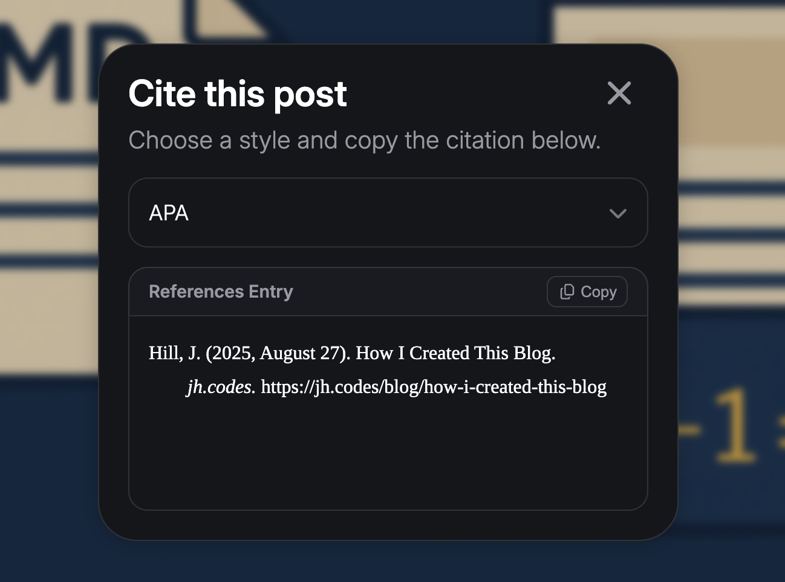

# How I Created This Blog

After challenging myself to create this HTML, CSS, and JavaScript (no framework) website to solidify my foundational knowledge of JavaScript and web development, I thought it would be cool to develop a low maintenance blog to share what I'm building and discovering. Throughout this blog post, I will outline how this functions and what libraries and APIs I'm utilizing. I will unpack the specifics of how the following components of my blog work:

- Structure
- Inline Code and Code Blocks
- KaTeX Math
- Desmos Graphs
- Citation Generator

## Structure

Chosing what would define the structure of my blog posts was easy. [Markdown](https://www.markdownguide.org/getting-started/) is a lightweight markup language commonly used for blogs, documentation, or really any text content on the web because of its ease of writing. Each blog post is written in Markdown and then converted to HTML by [Marked.js](https://marked.js.org/) before being rendered within the UI of my website.

## Inline Code and Code Blocks

Inline code appears `like this` and is styled by selecting the `<code>` elements in CSS and applying a monospace font, light border, and subtle background color.

Code blocks, which appear like this...

```python
print("Hello, World!")
```

...are good for displaying multiple lines of code in a monospaced color-coded format. Code blocks are placed in a set of tripple backticks (` ``` `) in Markdown and when converted to HTML are in a `<code>` tag within a `<pre>` tag, which displays the code as typed originally (preserving the whitespace). To color code the code blocks, I used [Highlight.js](https://highlightjs.org/), which has automatic language detection and support for hundreds of languages and themes. I also made each code block include a language label and copy button for convenience.

A complete code block with these styles and features applied looks like this:

```javascript
const mean = arr => arr.length ? arr.reduce((a, v) => a + v, 0) / arr.length : 0;

let numbers = [2, 5, 3, 26, 8, 52];
console.log(mean(numbers));
```

## KaTeX Math

I plan to write about math in the future, so I needed a way to render mathematical notation. After comparing a few different JavaScript LaTeX libraries, I chose [KaTeX](https://katex.org/) for its speed and lightweight design.

Typing this LaTeX will result in the following beautifully formatted math:

```latex
$$\int_a^b f(x) \thinspace dx = \lim_{n \to \infty} \sum_{i=1}^{n} f(x_i^*) \thinspace \Delta x$$
```

$$\int_a^b f(x) \thinspace dx = \lim_{n \to \infty} \sum_{i=1}^{n} f(x_i^*) \thinspace \Delta x$$

## Desmos Graphs

A great way to visualize math is with a graph, so using the [Desmos API](https://www.desmos.com/api), I can easily embed an interactive graph into a blog post. As an example, below is the graph of $\cos(2x) + \sin(2y) \ge \frac{1}{15}$.

<div id="calculator"></div>

## Citation Generator

I decided to create a citation generator, which would operate in a popup modal and generate a specially-formated citation in either the [APA](https://apastyle.apa.org/), [MLA](https://www.mla.org/mla-style), [Chicago](https://www.chicagomanualofstyle.org), or [IEEE](https://journals.ieeeauthorcenter.ieee.org/wp-content/uploads/sites/7/IEEE_Reference_Guide.pdf) style based on the metadata for the blog post stored in a JSON file. Although a non-essential element to a blog, the citation generator was fun to create, and I'm satisfied with how it turned out.



## Conclusion

These custom elements, in addition to standard Markdown capabilities, allow for effortless creation of richly formatted and interactive blog posts. The most important goal of my blog sharing insights through simple, clear communication, and I believe I've built a system capable of supporting this objective.